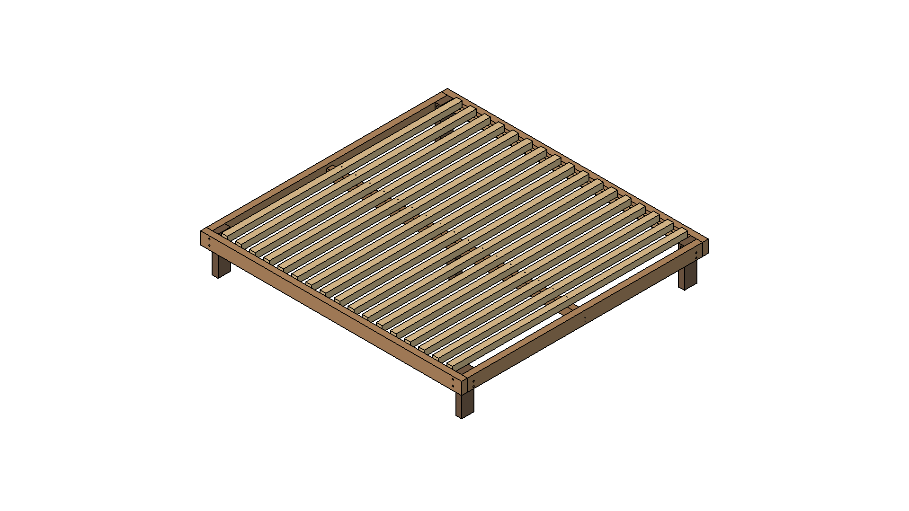
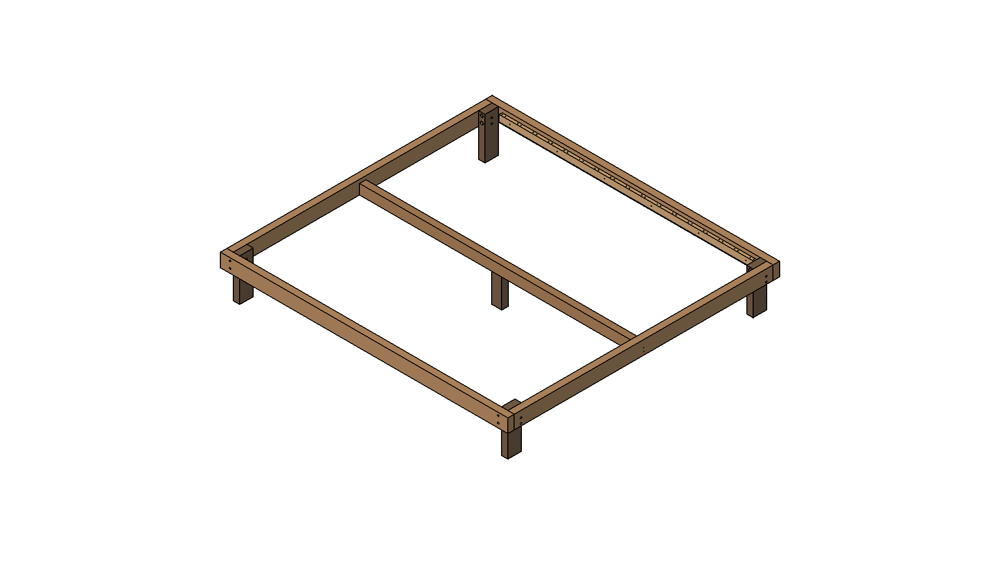
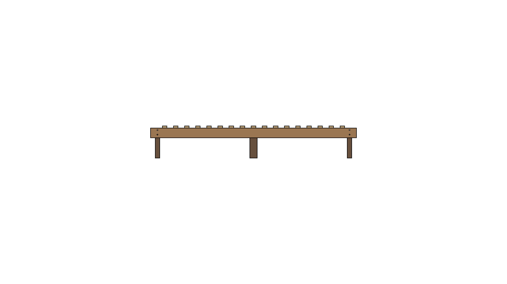
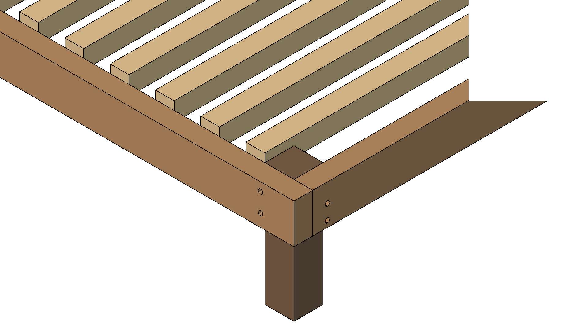
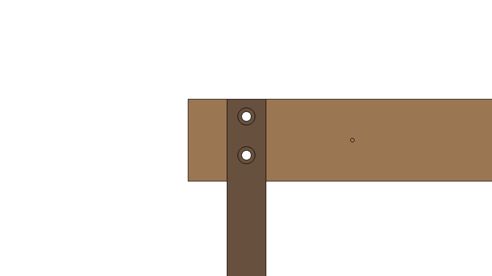
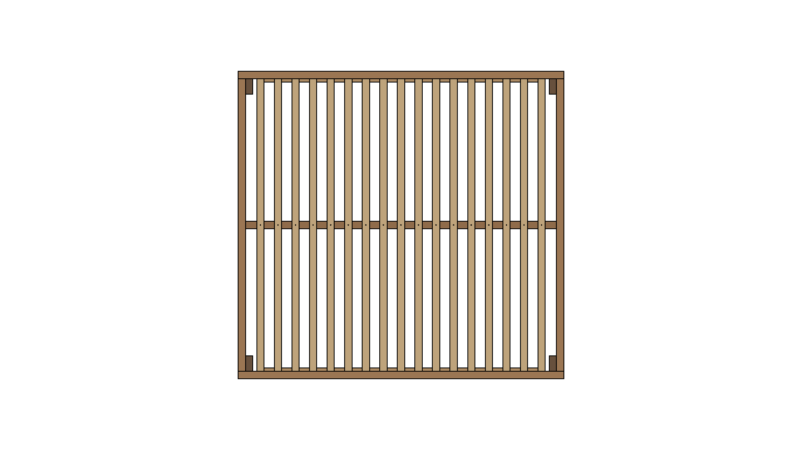

# Sengebund til futon 180 × 200 cm

Let, ubehandlet futon-sengebund i fyr/gran: slank **45×95-ramme** boltet i hjørnerne,
**17 kvadratiske 45×45-lameller** der flugter med rammens overkant, og en langsgående
**midterdrager på ét midterben**, der halverer lamelspændet. Udvendige mål er
madrasmålet, så madrassen ligger plant af med kanten — ingen liste op om.

Ingen lim, ingen trykimprægneret træ og ingen avanceret træbearbejdning: **alle snit er
lige**, og alle samlinger er skruet eller boltet. Benene skæres af afskærene, så du
køber intet træ til dem.

<div class="figrow">
<figure><figcaption>Færdig sengebund</figcaption></figure>
<figure><figcaption>Understel — lameller skjult</figcaption></figure>
</div>

| Kort fortalt | |
|---|---|
| Udvendige mål | 1800 × 2000 mm (= madrassen, flush) |
| Sovehøjde | 295 mm bund + 15–18 cm futon ≈ 45 cm |
| Frihøjde til gulv | 200 mm under rammen, 205 mm under drageren |
| Vægt | ~48 kg |
| Træ | 22 reglar + 2 forskallingsbrædder, ubehandlet fyr/gran |
| Fastgørelse | 103 skruer i tre længder + 16 gennemgående bolte + 2 vinkelbeslag |
| Pris | ~1.650 kr (juli 2026) |
| Sværeste opgave | de 8+8 bolthuller i benene — de skal bores vinkelret |

**Rækkefølgen i vejledningen er arbejdsrækkefølgen:** indkøb → værktøj → skæreplan →
boring → samling → kontrol. Bagest ligger fire målsatte tegninger og et statik-tjek.
Boringen er det store stykke arbejde (103 huller plus forsænkninger); samlingen går
hurtigt, når hullerne sidder.

## 1 · Sådan er sengen bygget {: .newpage }

```
      ← 200 cm (længde) →
   ┌────────────────────────────┐   ┐
   │ ▪  ▪  ▪  ▪  ▪  ▪  ▪  ▪  ▪  ▪ │   │  ← 45×45 lameller (17 stk)
   │ ═══════ midterdrager ══════ │   │     spænder tværs, hviler på
   │ ▪  ▪  ▪  ▪  ▪  ▪  ▪  ▪  ▪  ▪ │   │     3 punkter: liste-drager-liste
   └────────────────────────────┘   ┘  180 cm (bredde)
   ▙             ▪              ▟
   ben        midterben         ben
```

- **To vanger 45×95 + to endestykker** boltes sammen om 4 hjørneben = en stiv kasse.
- **Støttelister 21×45** skrues på vangernes indersider og bærer lamelenderne.
- **Midterdrageren 45×45** løber i længderetningen på ét midterben og halverer
  lamellernes frie spænd fra 1710 mm til ~810 mm.
- **Lamellerne 45×45** flugter med rammens overkant. Det halverede spænd gør den lille
  kvadratiske profil stiv nok, og et kvadratisk tværsnit kan ikke vælte. Madrassen
  hviler plant på ramme og lameller i samme kote.

### Højder (alle mål fra gulv)

```
   top af lameller = top af ramme  295 mm  ┄┄┄┄ sovefladen (lameller flugter med rammen)
   lamel-underkant                 250 mm  ─────┐
   støtteliste-overkant            250 mm       │  vange 95 mm
   underkant ramme                 200 mm  ─────┘  ← 20 cm FRIHØJDE
   underkant drager (45×45)        205 mm  ─────   ← 5 mm over rammens underkant
   gulv                              0 mm  ▂▂▂▂▂▂
```

Hjørnebenene er derfor **295 mm** (200 + 95) og midterbenet **205 mm**. Frihøjden er
200 mm under rammen og 205 mm under drageren, så en robotstøvsuger på 20 cm går fri
overalt — også under midten.

<div class="figrow">
<figure><figcaption>Langside</figcaption></figure>
<figure><figcaption>Gavl</figcaption></figure>
</div>

## 2 · Indkøb

### Træ (fyr/gran, ubehandlet, høvlet)

| Vare | Antal | Pris/stk | I alt | Bruges til |
|------|-------|----------|-------|------------|
| Reglar 45×45×2400 ubeh. | 18 | 64,80 | 1.166,40 | 17 lameller + 1 midterdrager |
| Reglar 45×95×2400 ubeh. | 4 | 43,80 | 175,20 | 2 vanger + 2 endestykker |
| Forskalling 21×45×2400 ubeh. | 2 | 17,40 | 34,80 | 2 støttelister |
| Ben (4 hjørne + 1 midter) | 0 | — | 0 | **skæres af afskærene** ♻️ |

**Træ i alt 1.376,40 kr** (Silvan, juli 2026, ekskl. levering). Der er kun to
reglar-tværsnit at holde styr på: 45×45 til lameller og drager, 45×95 til rammen.

### Skruer, bolte og beslag

| Vare | Køb | Bruges |
|------|-----|--------|
| Spånskrue 4,5 × 60 (fx Simpson TTZNFS, art. 74485) | 200-pak | 85 |
| Spånskrue 4,5 × 50 (art. 74484) | 200-pak | 12 |
| Spånskrue 5,0 × 80 (art. 76540) | 100-pak | 6 |
| Beslagskrue 4,0 × 20, **fladt** hoved (Simpson TTUFP, art. 74519) | 200-pak | 16 |
| Bræddebolt **M10 × 160** DIN 603 (jem&fix, NKT) | 4 × 2-pak à 39,95 = **159,80 kr** | 8 |
| Løse **M10-møtrikker** til kontramøtrik | 8 stk (~25 kr) | 8 |
| Spændeskive M10, 10,5 × 30 × 2,5 | 15-pak | 8 |
| Bræddebolt **M8 × 100** m/ møtrik | 12-pak | 8 |
| Spændeskive M8, **8,4 × 24** × 2,0 | 30-pak | 8 |
| Vinkelbeslag Simpson AC35350 | 2 stk | 2 |

Alle skruer skal være **spånskruer med undersænket hoved, Torx og delgevind**.
Elforzinket rækker fint indendørs; rustfri er kun nødvendigt udendørs. Beslagskruerne
er undtagelsen — de skal have **fladt** hoved, for en undersænket skrue trækker sig ned
i beslagets hul og kan flække det.

Pakkestørrelserne giver rigeligt overskud. Det var det billigste: skruerne findes ikke
i mindre pakker i de længder.

⚠️ **Køb M10 × 160 til vangerne — ikke M10 × 140.** Vange-aksen går gennem 45 + 95 =
140 mm træ, så en 140 mm bolt ender præcis plant med træet og har nul gevind tilbage
til møtrikken. 160 mm giver de 20 mm, der skal til skive + møtrik + kontramøtrik.
jem&fix har dem kun i 2-pak, og der findes intet mellem 140 og 160 (en M10 × 200 ville
stritte 60 mm ud).

**Skiverne skal være store.** En almindelig M8-planskive er kun Ø16 og trækker sig ind
i træet — derfor Ø24 på endestykke-aksen. Skiven gør mere for samlingen end
boltdiameteren.

## 3 · Værktøj og bor

- **Kap-/geringssav eller rundsav med anslag** — 23 lige snit, ingen geringer
- **Søjleboremaskine eller borelære** — nødvendig til benenes bolthuller, se
  advarslen om boltkrydset i afsnit 5
- **Boremaskine + skruemaskine** med Torx-bit (størrelsen står på skruepakken)
- **Bor:** Ø2,5 · Ø3 · Ø3,5 · Ø5 · Ø5,5 · Ø10 · Ø12
- ⚠️ **Ø10 og Ø12 skal være lange bor:** de går gennem 90 hhv. **140 mm** træ i én
  gennemgang. Et almindeligt 100 mm-spiralbor rækker ikke — brug et slangebor eller et
  langt spiralbor med mindst 160 mm nyttelængde
- **Én kegleforsænker 90°, Ø16, HSS, sekskantskaft** (~60–100 kr)
- **Fastnøgle/top 13 mm** (M8) og **17 mm** (M10) + en tang til at holde boltehovedet
- Båndmål (5 m), vinkel, blyant, mindst 4 skruetvinger, malertape (til at markere
  boredybde), sandpapir 120
- **To bukke, kasser eller stole** at sætte sengen op på, når lamellerne skal skrues
  fast nedefra

**Køb ikke et kombineret undersænkbor.** Det borer forhul og forsænker i én bevægelse
med én diameter — men her skal den nære del have Ø5 gennemgang og den fjerne Ø3 pilot,
altså to diametre i samme hul. En løs kegleforsænker er den rigtige.

## 4 · Skæreplan

Skær alt op først, og **mærk afskærene op med det samme** — de fem ben kommer af dem.

| Emne | Køb | Skæres til | Afskær |
|------|-----|------------|--------|
| Lameller | 17 × 45×45×2400 | 1 à **1710** pr. stk | 17 × 690 (overskud) |
| Midterdrager | 1 × 45×45×2400 | 1 à **1910** | **1 × 45×45×490 → midterben** |
| Vanger | 2 × 45×95×2400 | à **2000** | **2 × 45×95×400 → hjørneben** |
| Endestykker | 2 × 45×95×2400 | à **1710** | **2 × 45×95×690 → hjørneben** |
| Støttelister | 2 × 21×45×2400 | à **1770** | 2 × 630 (overskud) |

### Ben af afskær (køb intet nyt træ ♻️)

| Ben | Antal | Skæres af | Længde |
|-----|-------|-----------|--------|
| Hjørneben 45×95 | 4 | de fire 45×95-afskær (400, 400, 690, 690) | à **295** |
| Midterben 45×45 | 1 | drager-afskæret (490) | à **205** |

Hjørnebenet vender med **45 mm-fladen mod endestykket** og **95 mm-fladen mod vangen**.
Så holder de 45 mm sig fri af lamelfeltet, og de to boltakser får hver sin flade.
Midterbenet har ingen bolte, så dets orientering er ligegyldig.

Lamellerne er de eneste dele, hvor længden skal være ens til en millimeter: sæt et stop
på saven og skær alle 17 uden at flytte det. Drageren (1910) og endestykkerne (1710)
skal passe mellem hinanden — mål dem op mod rammen, før du skærer, hvis dit træ ikke er
præcis 45 mm tykt.

<div class="figrow">
<figure><figcaption>Hjørne: vange, endestykke, ben og støtteliste</figcaption></figure>
<figure><figcaption>Hjørneben med sine 4 bolthuller</figcaption></figure>
</div>

## 5 · Boring

Princippet er det samme i alle 103 skruesamlinger: **gennemgangshul i den nære del**
(det er det, der lader skruehovedet trække delene sammen) og **pilothul i den fjerne
del**. Tommelfingerregler i fyr/gran: gennemgang = skruediameter + 0,5 mm, pilot ≈ 65 %
af skruediameteren, forsænkning Ø ≈ 2 × skruediameteren.

Del arbejdet i to: gennemgangshullerne bores på bænken, før du samler noget, og
pilothullerne bores under samlingen gennem de huller, du allerede har lavet. Så passer
de af sig selv.

### A · Bores på bænken, del for del

| Del | Antal | Huller |
|-----|-------|--------|
| **Støtteliste** 21×45×1770 | 2 | **34 × Ø5** lodret gennem listens 45 mm højde (lamelhullerne — mål efter arket "Boreplan · støtteliste") · **6 × Ø5** vandret gennem de 21 mm: 75 mm fra enden, derefter 330 mm c/c, midt i højden. Forsænk Ø10 i listens underside hhv. inderside |
| **Hjørneben** 45×95×295 | 4 | **2 × Ø12** gennem 95 mm-fladen (mod vangen), **230 og 275 mm** over benets fod · **2 × Ø10** gennem 45 mm-fladen (mod endestykket), **215 og 250 mm** over foden. Alle fire vinkelret — se advarslen nedenfor |
| **Vange** 45×95×2000 | 2 | **4 × Ø12** gennem de 45 mm: 67 mm fra hver ende, 30 og 75 mm over vangens underkant |
| **Endestykke** 45×95×1710 | 2 | **4 × Ø10**: 47 mm fra hver ende, 15 og 50 mm over underkanten · **2 × Ø5,5** midtfor (855 mm fra enden), 23 og 47 mm over underkanten, **forsænk Ø11 på ydersiden** |
| **Midterdrager** 45×45×1910 | 1 | **2 × Ø5,5** lodret ned, 940 og 970 mm fra én ende (= midten ±15), forsænk Ø11 i overkanten |
| **Lamel** 45×45×1710 | 17 | **1 × Ø5** lodret, 855 mm fra enden (midt), forsænk Ø10 så hovedet ender **2–3 mm under** overfladen |
| **Midterben** 45×45×205 | 1 | ingen — dets pilothuller bores under samlingen |

Bemærk de to nulpunkter: benets huller måles fra **benets fod** (den står på gulvet),
rammens fra **vangens/endestykkets underkant**. De passer sammen, fordi rammens underkant
sidder 200 mm over gulvet: 30 mm op ad vangen er de samme 230 mm op ad benet.

Bolthullerne er 2 mm større end boltene (Ø12 til M10, Ø10 til M8), fordi Ø11 og Ø9 ikke
altid kan skaffes. Slørret er en fordel her: det giver plads til, at ben og ramme bores
hver for sig. Til gengæld **bider bræddeboltens firkanthals ikke** i det store hul — hold
hovedet med en tang, når du spænder møtrikken.

### B · Bores under samlingen

| Hvor | Bor | Gennem |
|------|-----|--------|
| Støtteliste → vange | Ø3 × 35 mm i vangen | listens Ø5-hul, når listen er spændt fast i højden |
| Lamelfod → støtteliste | Ø3 × 20 mm op i lamellen | listens Ø5-hul, når lamellen ligger på plads |
| Lamel → midterdrager | Ø3 (kan undværes) | lamellens Ø5-hul |
| Midterdrager → endestykke | Ø3,5 × 40 mm i dragerens endetræ | endestykkets Ø5,5-hul |
| Midterdrager → midterben | Ø3,5 × 40 mm i benets endetræ | dragerens Ø5,5-hul |
| Vinkelbeslag | Ø2,5 | beslagets egne huller |

### Forsænkning

Kegleforsænkeren er **ét bor, ikke to**: Ø16 er keglens største diameter, ikke hullets.
Du styrer diameteren med dybden, så Ø10 og Ø11 er samme bor i to dybder. 90° er vinklen
på metriske træskruehoveder (82° er til metal og passer ikke). Bor hullet **først** og
forsænk bagefter, så keglen har noget at centrere sig i. Kør 400–800 o/min med let tryk,
ellers hopper den og efterlader et trekantet hul. Prøv af på et afskær, og sæt tape på
boret i den rigtige dybde.

**23 af de 103 forsænkninger er ikke valgfri:**

- **De 17 i lamellerne** sidder i sovefladen — sænk hovedet 2–3 mm **under** overfladen,
  ikke bare plant.
- **De 4 i endestykkerne** sidder på sengens synlige yderside.
- **De 2 i dragerens overkant** ligger, hvor midterlamellen hviler. Stikker de hoveder
  1 mm op, vipper lamellen.

De øvrige 80 sidder på støttelistens under- og inderside, hvor intet ses og intet
hviler. Dér er forsænkning pænt, men ikke nødvendigt.

⚠️ **Forsænk til Ø11 for 5 × 80-skruerne.** Deres hoved er Ø10, så en Ø10-forsænkning er
lige præcis for lille til, at hovedet går plant. De 4,5-skruer har Ø9-hoved, hvor Ø10
rækker.

⚠️ **Boltkrydset i benene.** Vange- og endestykke-boltene krydser hinanden vinkelret
inde i benet med kun **15 mm lodret afstand** — altså **4 mm træ** mellem Ø12- og
Ø10-hullet. Derfor: bor vinkelret (borelære eller søjleboremaskine), og bor **alle fire
huller i et ben, før** du sætter nogen bolt i. Skævt borede huller mødes inde i benet.

⚠️ **Hullerne i støttelisten skal være Ø5, ikke Ø4.** Ø4 er et pilothul: gevindet vil
gribe i listen og jække de to dele fra hinanden i stedet for at spænde dem sammen, og
med kun ~8 mm træ til hver side flækker en 21 mm liste let langs åren. Bor lodret og
præcist.

⚠️ **De to skruer ned i midterbenet er det sted, hvor der er mindst træ.** De sidder
±15 mm fra benets midte i et 45×45 ben — altså **7,5 mm fra kanten**, i endetræ. Med
Ø5,5 er der knap 5 mm træ ud til fladen, så pilothullet er ikke valgfrit dér. Borer du i
hånden, må du gerne rykke de to huller ind til ±10 mm fra midten (12,5 mm til kanten) —
så flytter du blot dragerens gennemgangshuller tilsvarende.

⚠️ **Bor støttelisten færdig, før du skruer den på vangen.** Et af de seks vange-huller
(1725 mm fra enden) ligger kun 10,5 mm fra et lamelhul (1735,5 mm) — ca. 5,5 mm træ
mellem to Ø5-huller. Det er lettere at ramme rigtigt på en løs liste. Og de forborede
lamelhuller er selv afstands-jiggen, der placerer lamellerne senere.

**Vend begge støttelister samme vej.** Lamelhullerne ligger symmetrisk om listens midte,
men de seks vange-huller gør ikke — så begge lister skal have deres 0-ende mod samme
gavl.

## 6 · Samling

### Trin 1 · Ben på vangerne — 8 × M10 × 160

Stil en vange på højkant på gulvet og sæt et hjørneben op mod dens inderside i hver
ende:

- benets **overkant flugter med vangens overkant**
- benets ende sidder **45 mm inde** fra vangens ende (brug et 45 mm afskær som
  afstandsklods — pladsen er til endestykket)
- benets 95 mm-flade ligger mod vangen

Spænd fast med tvinger, stik boltene i **udefra**, og sæt skive + møtrik +
**kontramøtrik** på benets inderside. Hold boltehovedet med en tang, mens du spænder.
Gentag med den anden vange. Kontramøtrikken er ikke pynt: ubehandlet fyr svinder det
første år, og boltede træsamlinger løsner sig, når træet krymper.

Der stikker 20 mm bolt ud på indersiden, og skive + to møtrikker fylder 18,5 — altså
reelt plant. **Ingen forsænkning nogen steder** på denne seng.

### Trin 2 · Støttelister på vangerne — 12 × 4,5 × 50

Med vangen stadig løs er listen let at ramme. Listens **overkant skal ligge 45 mm under
vangens overkant** (= 5 mm over vangens underkant), og listen starter **115 mm inde** fra
vangens ende i begge ender. Spænd fast, bor Ø3 × 35 pilot gennem listens Ø5-huller og
skru 4,5 × 50 i.

Brug ikke 60 mm her. Det er den eneste samling, der går **vandret** gennem listens
21 mm: 21 + 45 = 66 mm stak, så en 70'er ville stikke ud på vangens yderside. 50 giver
29 mm fat i vangen og 16 mm margin.

### Trin 3 · Rammen lukkes — 8 × M8 × 100

Stil de to langsider op med benene nedad og sæt endestykkerne ind mellem dem. Endestykkets
yderside flugter med vangens ende, og dets 45 mm-flade ligger mod benet.

⚠️ **Pres hjørnet helt sammen, før møtrikken sættes på.** M8 × 100 gennem 45 + 45 = 90 mm
efterlader kun 10 mm gevind, og møtrik + Ø24-skive bruger 8,5 af dem. Er der 2 mm luft i
hjørnet, når møtrikken ikke gevindet. Derfor også: **ingen kontramøtrik og ingen nyloc på
denne akse** — en M8 nyloc er ~8 mm høj og løber tør for gevind. Spænd vange-boltene
efter, så hjørnet er lukket, inden du går videre.

Rammen er nu en stiv kasse. Kontrollér diagonalerne (hjørne til hjørne skal måle ens),
før du fortsætter.

### Trin 4 · Midterdrager og midterben — 4 + 2 × 5 × 80 og 2 vinkelbeslag

Drageren på 1910 mm passer præcis mellem endestykkerne. Dens **overkant skal flugte med
støttelisternes overkant** (45 mm under rammens overkant) — så ligger lamellerne plant på
alle tre understøtninger. Understøt den midlertidigt i midten, spænd enderne fast, bor
Ø3,5 × 40 pilot gennem endestykkets to Ø5,5-huller ind i dragerens endetræ, og skru
5 × 80 i.

Endetræ alene er en svag samling, så hver ende får desuden et **vinkelbeslag**. Montér
det på **siden** af drageren, ikke over eller under — ellers koster det frihøjde. Brug de
fire Ø5-huller i hver vinge med beslagskruer (fladt hoved, Ø2,5 pilot). Vil du følge
Simpsons anbefaling helt, køb 4 beslag og sæt et i hver side af drageren.

Sæt til sidst **midterbenet** under drageren på midten. Dets 205 mm er præcis frihøjden,
så drageren løfter sig ikke: bor Ø3,5 × 40 ned gennem dragerens to Ø5,5-huller i benets
endetræ og skru to 5 × 80 lodret ned ovenfra. De seks 80 mm-skruer er de eneste, der går
i endetræ, hvor holdeevnen kun er 50–75 % af sidetræs — derfor 35 mm fat i stedet for 15.

### Trin 5 · Lamellerne — 68 + 17 × 4,5 × 60

Lamellerne skrues **nedefra og op**, så der ikke kommer skruehoveder i sovefladen. Sæt
derfor sengen op på to bukke, kasser eller stole, så du kan komme til med maskinen
nedefra. Skruerne sidder kun ~56 mm inde fra sengens yderkant, så du skal ikke ind under
midten. (Har du en kort eller vinklet skruemaskine, kan det gøres i de 200 mm frihøjde,
men det er trangt.)

1. Læg lamellerne på plads: to ender på støttelisterne, midten på drageren.
2. Centrér hver lamel over sit hulpar i listen. Hullerne sidder 24 mm fra hinanden,
   centreret på lamellens 45 mm fod — **de forborede huller er selv afstands-jiggen**, så
   når lamellen dækker sit par symmetrisk, sidder den rigtigt. Afstanden bliver
   107,8 mm c/c og spalten ~63 mm.
3. **Nedefra:** bor Ø3 × 20 mm op i lamellen gennem listens Ø5-hul, og skru en 4,5 × 60
   i. Hullet i listen er 45 mm dybt, så skruen får 15 mm fat i lamellen og bryder ikke ud
   i sovefladen. To skruer i hver ende, 68 i alt.
4. **Oppefra:** én 4,5 × 60 ned gennem lamellens forborede midterhul i drageren. Hovedet
   skal 2–3 mm under overfladen.

Begge lamelsamlinger *hviler* — lamellen bærer sin last på listen og drageren, så
skruerne er ren lås. Derfor er 15 mm fat rigeligt.

<div class="figrow one">
<figure><figcaption>Færdigt lamelfelt set ovenfra — 17 lameller, c/c 107,8 mm</figcaption></figure>
</div>

### Trin 6 · Kontrol og efterspænding

- **Står den plant?** Vipper sengen, sæt en tynd skive under det ene ben eller slib
  1 mm af. Gulvet er sjældent plant, og benene er af afskær.
- **Kør en hånd over lamellerne.** Intet skruehoved må rage op — det er det, madrassen
  og betrækket ligger på.
- **Slib kanterne let** på ramme og lameller med sandpapir 120. Det sparer futonens
  betræk.
- **Efterspænd de 8 M10-bolte** efter 2–4 uger og igen efter en fyringssæson. Ubehandlet
  fyr svinder, og det er derfor kontramøtrikkerne sidder der.
- Sengen er tænkt ubehandlet. Vil du olie eller sæbebehandle den, gør det **før**
  samling, mens delene er løse.

## 7 · Holder det til to personer? {: .newpage }

Kort statik-tjek for fyr (E ≈ 10 GPa), regnet på den byggede geometri. Grænsen L/300 er
den normale komfortgrænse for en sengebund:

| Del | Frit spænd | Nedbøjning ved fuld last | Grænse L/300 |
|-----|-----------|--------------------------|--------------|
| Lamel 45 × 45 | 810 mm | ~1,7 mm (50 kg punktlast midt på ét fag) | 2,7 mm |
| Midterdrager 45 × 45 | 2 fag à 955 mm | ~3–4 mm pr. fag | ~3,2 mm |
| Vange 45 × 95 | 1910 mm | 1–2 mm | ~6,4 mm |

Lamellerne er kontinuerte over drageren, hvilket gør dem stivere endnu, og et kvadratisk
tværsnit (slankhed 1:1) kan ikke vælte — domino-problemet fra høje, tynde lameller
findes ikke her.

**Drageren er et grænsetilfælde** lige omkring L/300. Uproblematisk under en eftergivende
futon, men vil du have mere margin: sæt drageren på højkant som 45 × 70 — så falder
frihøjden under midten fra 205 til 180 mm, altså under de 20 cm — eller sæt et midterben
mere i, hvilket ikke koster frihøjde.

**Boltene er kraftigt overdimensionerede.** Belastningen er ~2,3 kN fordelt på fire
hjørner, altså ~600 N pr. hjørne på to bolte. Grænsen sættes ikke af bolten (en M8 kan
~8,8 kN i forskydning) men af træets hulrandstyrke: 8 mm × 45 mm × ~25 MPa ≈ 9 kN — 15
gange over behovet. Derfor er M8 rigeligt på endestykke-aksen, og derfor betyder de 2 mm
op til M10 ingenting. Det, der betyder noget, er skivens størrelse.

### Vil du ændre noget?

- **Færre lameller:** 16 stk. sparer ~1,7 kg og giver ~71 mm spalte — fint i den brede
  ende for en blød futon. Både lamellængder og støttelistens hulmønster skal så regnes om.
- **Stivere midte:** et ekstra midterben er den billige vej — det koster ét hul og ingen
  frihøjde. En 45 × 70-drager på højkant er stivere endnu, men efterlader kun 180 mm under
  midten.
- **Anden madras:** rammen er madrasmålet. Ændrer du det, ændrer vanger (2000),
  endestykker/lameller (1710) og drager (1910) sig alle sammen.

### Forbehold

- **Pris:** træet er prischecket til 1.376,40 kr hos Silvan og vange-boltene til
  159,80 kr hos jem&fix (juli 2026). Skruer og beslag er fire pakker, som ikke er
  prischecket — regn med ~1.650 kr i alt. 45×45-lameller er dyre pr. bræt, men benene er
  gratis.
- **Ben af afskær:** ben-tværsnittet er 45 × 95, hvilket er slankt for et sengeben. Det
  holder, fordi rammen er en stiv boltet kasse, så benene står i ren tryk. Valget er også
  praktisk: der fandtes ingen firkantet, ubehandlet stolpe hos jem&fix, Silvan eller
  Bauhaus — alle massive stolper er trykimprægnerede eller malede.
- **Lamelspalte ~63 mm** og åbningsareal ~58 %. God udluftning nedefra og uproblematisk
  for en futon; til en tynd madras uden futon-fylde ville man vælge tættere lameller.

## 8 · Tegninger {: .newpage }

De fire ark bagest er målsatte og hører til hvert sit trin:

| Ark | Brug det til |
|-----|--------------|
| Tegning — mål, plan og opstalt | overblik og kontrolmål (afsnit 1 og 4) |
| Boreplan — bolte og skruer | benene, vangerne og endestykkerne (afsnit 5 A) |
| Boreplan — støttelistens lamelhuller | alle 34 hulafstande, målt fra listens ene ende |
| Boreplan — midterdrager → endestykke | vinkelbeslagets placering (trin 4) |

**Mål alle 34 lamelhuller fra samme ende med båndmål** — step ikke 107,8 mm 16 gange, så
hober fejlen sig op. Kontrolmål: første hul 10,5 mm inde, sidste 10,5 mm fra den anden
ende, midterste lamel præcis på 885 mm.

<div class="colophon">
Model, tegninger og boreplaner er genereret fra en parametrisk FreeCAD-model
(<code>scripts/build_bed_let.py</code> → <code>cad/seng_let.FCStd</code>). Alle mål i
vejledningen er hentet fra den byggede model. Ændrer du dimensioner eller lamelantal,
skal tegninger og boreplaner genereres om.
</div>
